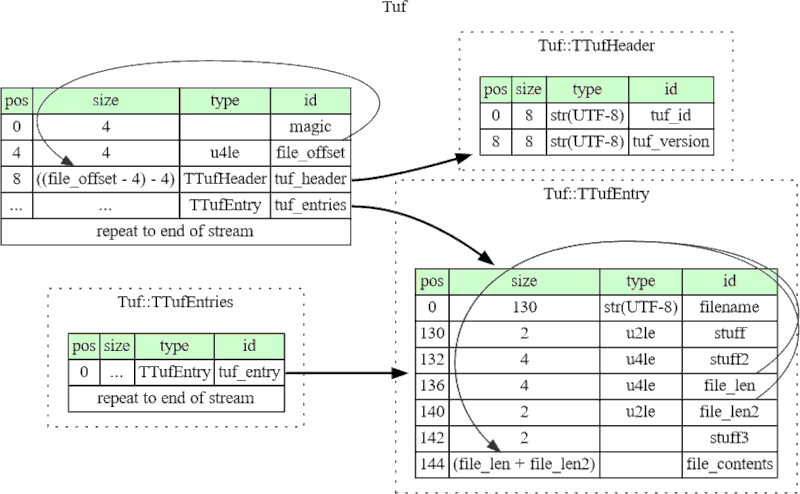

# onwatuf
TUF firmware file format dissection for ONWA Marine GPS Plotters (MK1)

ONWA Marine GPS plotters from the older MK1 series (like KCombo7) use a "TUF" firmware update format, which is basically a nunch of deflated files smushed together.



In this repository, you will find a basic file format description as a [Kaitai](https://kaitai.io) KSY file.

Additionally, there is a simple Python script based on Kaitai to extract the files from the TUF firmware update file.

## Usage

I case onwa_tuf.ksy was changed, regenerate onwa_tuf.py by `kaitai-struct-compiler --target python onwa_tuf.ksy`

### File extraction
```
usage: tuf.py [-h] [-o OUTPUT_DIR] [-w] firmware_update_file.tuf

TUF firmware file extractor

positional arguments:
  firmware_update_file.tuf

optional arguments:
  -h, --help            show this help message and exit
  -o OUTPUT_DIR, --output-dir OUTPUT_DIR
                        output directory
  -w, --write           actually write files (default: only list)

```

## Observations
  * Plotter is based on S3C2416X ARM9 system running Linux 2.16
  * `*.sh` bash shell scripts on MMC/SD-card will be executed during the update - the perfect chance to gain full control
  * later models use a different encrypted or at least obfuscated `xUF` file format, which is not covered here
  
### Possible "attacks"
 * Write a shell script which makes a complete dump of the firmware to MMC/SD-card. The mountpoint `/KP6XX/MMC` might differ, so check for mounted filesystems instead of a hardcoded path.
 * Check similar shell script approach on MK2 plotters to work out a decryption/deobfuscation method based on info from the files.
 * Get info about K-Chart file format
 * Get info about implementation of C-Map and Navionics charts (not on all models)
 * Ask manufacturer for sources of used software which is GPL and similarly licensed
